# Laboratorio 2: SQL Murder Mystery

**Estudiante:** Esteban Luna Seña.

**Curso:** Estructura de datos y laboratorio.

**Semestre:** 2026-01.

**Programa de Ingeniería de Sistemas**.

**Facultad de Ingeniería**.

**Universidad de Antioquia**.


## Resumen del caso

En esta investigación se analizó la base de datos de **SQL Murder Mystery** para identificar al responsable del asesinato ocurrido el **15 de enero de 2018 en SQL City**. A partir de los reportes del crimen, las entrevistas de los testigos, los registros del gimnasio y los datos de licencias, se concluyó que el **asesino material fue Jeremy Bowers**. 

----

## Recursos

Como base de investigación se entrega el siguiente **diagrama como  mapa base para entender cómo están conectadas las diferentes tablas de la base de datos** (personas, licencias de conducir, entrevistas, membresías de gimnasio, etc.) para el presente ejercicio.


----

## Forma de la entrega

- En `consultas/respuestas.sql` están las consultas principales y también varias consultas de apoyo.
- En `evidencia/`  las capturas por pasos para poder subir varias imágenes por cada parte del proceso.
- En este `README.md` se tiene el paso a paso de lo que hice y qué encontré.

----

## Bitácora de investigación

### 1. Revisión del reporte del crimen

**Qué quería averiguar:** encontrar el reporte exacto del asesinato para no empezar a buscar información al azar, es decir, en la fecha del asesinato luego de identificar la base de datos.

**Consultas**

```sql
SELECT *
FROM crime_scene_report
WHERE date = 20180115
  AND city = 'SQL City'
  AND type = 'murder';
```

```sql
SELECT *
FROM crime_scene_report
WHERE city = 'SQL City'
  AND date = 20180115;
```

**Lo que encontré:** el reporte decía que había dos testigos. Uno vivía en la última casa de `Northwestern Dr` y la otra testigo se llamaba **Annabel** y vivía en `Franklin Ave`.

**Evidencias:**
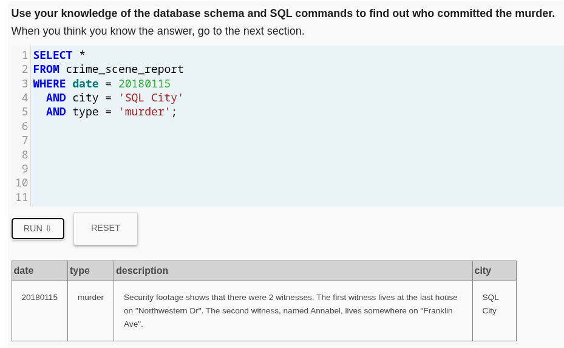
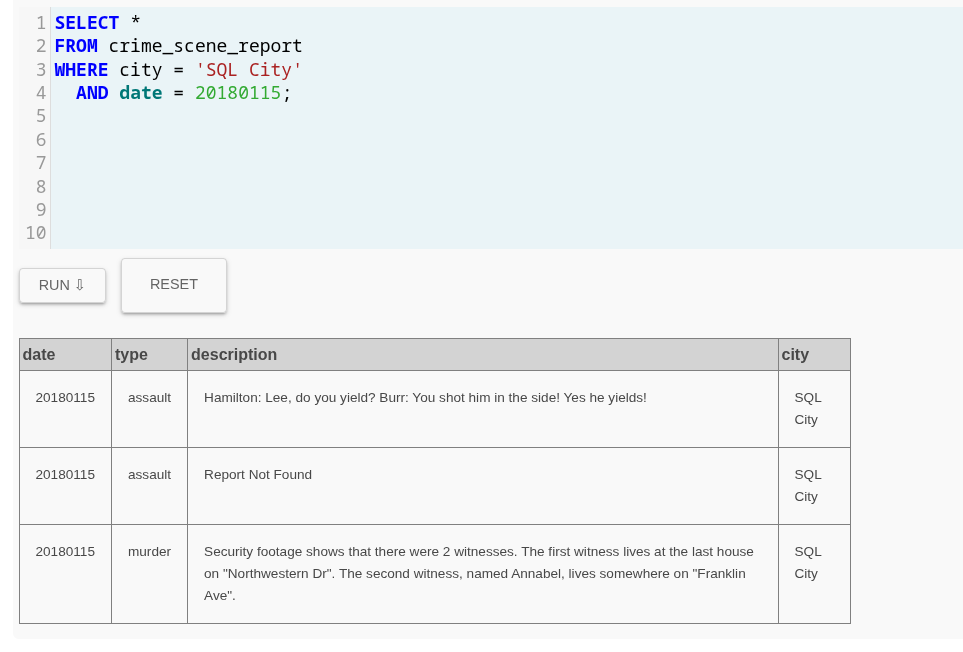

### 2. Identificación de los testigos

**Qué quería averiguar:** encontrar quiénes eran exactamente los dos testigos mencionados en el reporte.

**Consulta para ubicar a Annabel**

```sql
SELECT id, name, address_number, address_street_name
FROM person
WHERE name LIKE '%Annabel%'
  AND address_street_name = 'Franklin Ave';
```

**Consulta para encontrar la última casa de Northwestern Dr**

```sql
SELECT id, name, address_number, address_street_name
FROM person
WHERE address_street_name = 'Northwestern Dr'
ORDER BY address_number DESC
LIMIT 1;
```

**Evidencias:**

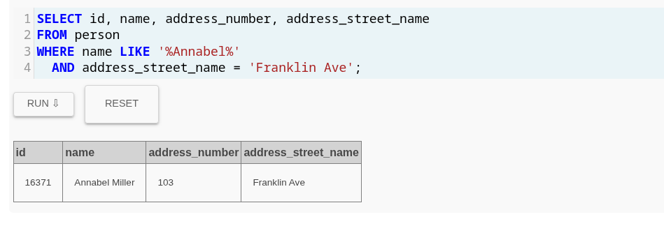
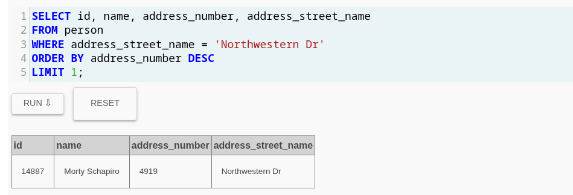


### 3. Leer las entrevistas de los testigos

**Qué quería averiguar:** obtener las pistas directas que dieron los testigos.

**Consultas:**

```sql
SELECT *
FROM interview
WHERE person_id IN (16371, 14887);
```

**Lo que encontré:** de las entrevistas saqué estas pistas principales:

- el asesino tenía una bolsa de **Get Fit Now Gym**,
- era miembro **gold**,
- la membresía empezaba por **48Z**,
- estuvo en el gimnasio el **9 de enero de 2018**,
- y su carro tenía una placa que incluía **H42W**.

**Evidencias de este paso**

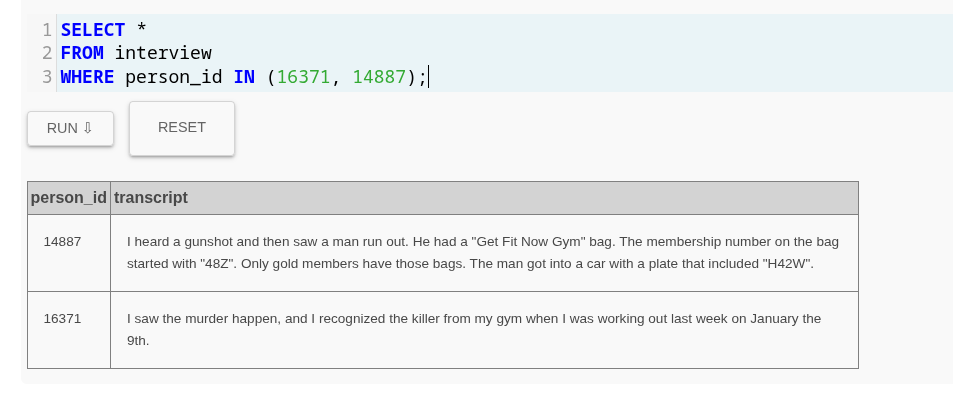

### 4. Filtrar sospechosos usando los datos del gimnasio

**Qué quería averiguar:** reducir la búsqueda a las personas que cumplieran con las pistas del gimnasio.

**Consultas:**


```sql
SELECT *
FROM get_fit_now_member
WHERE id LIKE '48Z%'
  AND membership_status = 'gold';
```

```sql
SELECT *
FROM get_fit_now_check_in
WHERE check_in_date = 20180109
  AND membership_id LIKE '48Z%';
```
**Lo que encontré:** después de cruzar esas condiciones, quedan dos sospechosos: **Joe Germuska** y **Jeremy Bowers**.

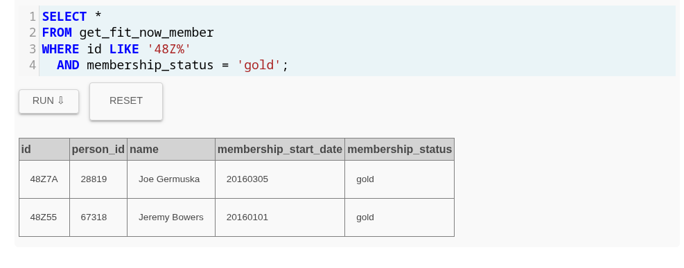
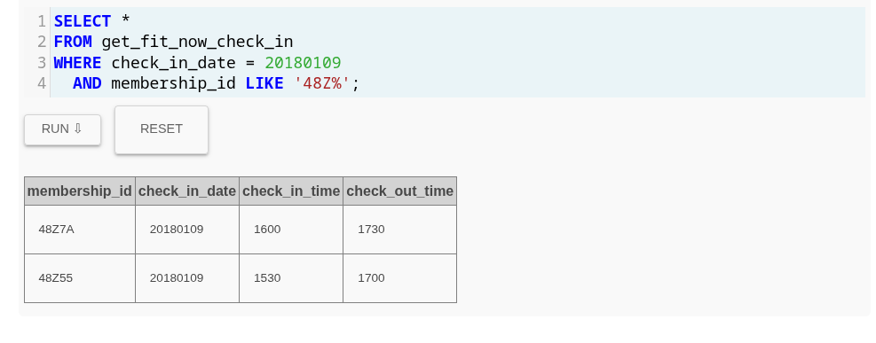

### Confirmar al asesino

**Qué quería averiguar:** decidir cuál de los dos sospechosos coincidía con la pista de la placa `H42W`.

**Consultas:**

```sql
SELECT p.id,
       p.name,
       dl.plate_number,
       dl.car_make,
       dl.car_model
FROM person AS p
JOIN drivers_license AS dl
  ON p.license_id = dl.id
JOIN get_fit_now_member AS gfnm
  ON p.id = gfnm.person_id
WHERE gfnm.id LIKE '48Z%'
  AND dl.plate_number LIKE '%H42W%';
```

```sql
SELECT p.id,
       p.name,
       dl.plate_number
FROM person AS p
JOIN drivers_license AS dl
  ON p.license_id = dl.id
WHERE p.name IN ('Joe Germuska', 'Jeremy Bowers');
```

```sql
SELECT *
FROM get_fit_now_member
WHERE name IN ('Joe Germuska', 'Jeremy Bowers');
```

**Evidencias:**

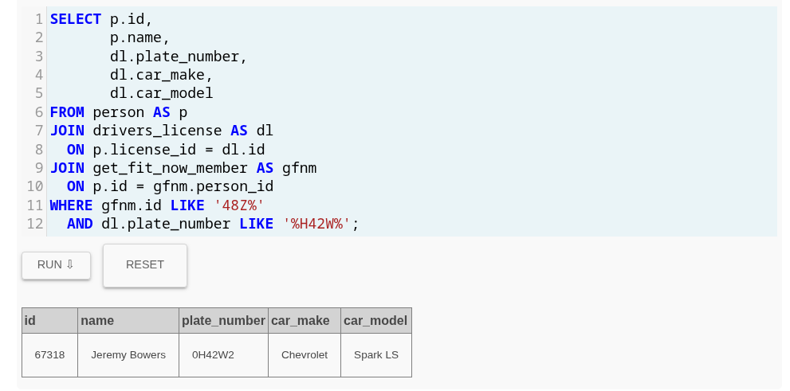
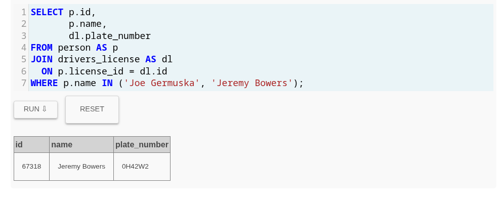
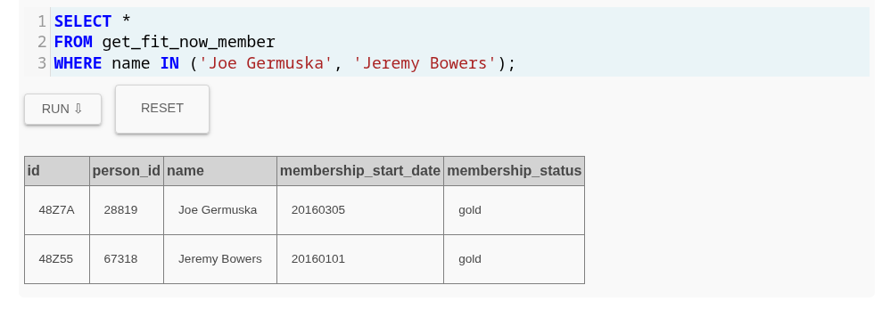


**Lo que encontré:** el único que coincidía con la placa era **Jeremy Bowers**, así que lo identifico como el asesino material.


**Verificación en la plataforma**

```sql
INSERT INTO solution VALUES (1, 'Jeremy Bowers');
SELECT value FROM solution;
```

**Evidencia:**

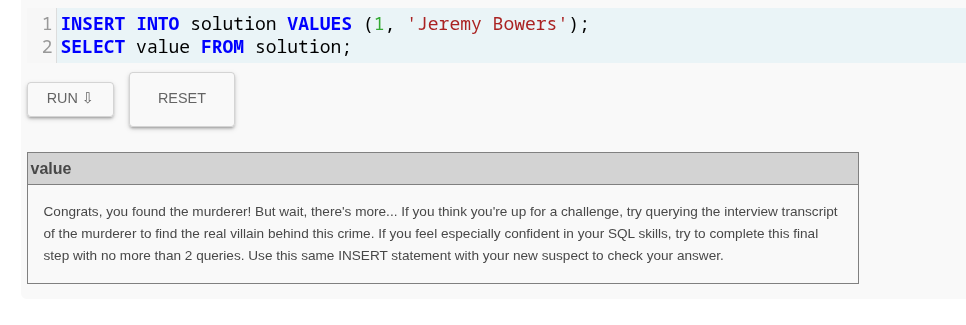

## Conclusión

Con este proceso pude resolver el caso en el cual se encuentra que **Jeremy Bowers** fue quien ejecutó el asesinato.

